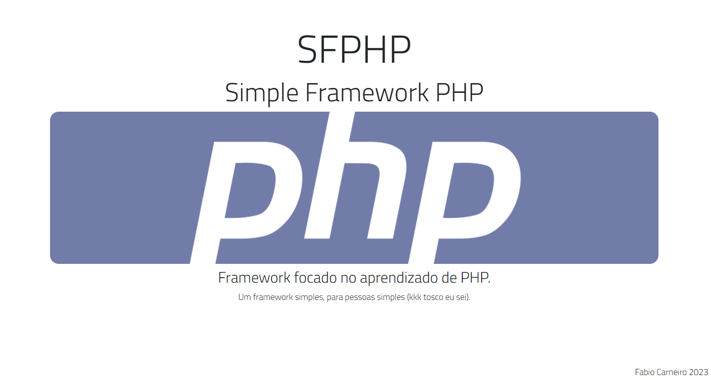

# Projeto SFPHP - Simple Framework PHP

O projeto tem finalidade de abordar conceitos avançados de PHP
seguindo o padrão MVC onde será usado para criar o framework por completo
com vários recursos para a construção de um sistema web completo
e funcional. O projeto tem como principal objetivo o aprendizado
e evolução dos conhecimentos já adquiridos antes do seu início, durante
sua evolução e até a conclusão deste projeto, podendo continuar
a medida que eu quiser e achar que é do meu interesse.

Este projeto poderá haver alterações drásticas, onde eu irei aplicar
mudanças que eu acho necessário segundo minha vontade, como é um projeto
focado em aprendizado, não tenho compromisso com boas práticas já
pré definidas por comunidades e ou entededores, irei aplicar tudo o que 
eu acreditar que será interessante aplicar no projeto, considerando meu 
aprendizado e meus desejos, assim será feito, sendo assim considere o 
projeto como laboratório de experimentos, e não um projeto sólido para 
ser usado em produção! Apesar disto, irei procurar aplicar mudanças
que por ventura serão focadas em melhorar a qualidade do projeto.

***
## ATENÇÃO

Este framework foi construído apenas para finalidade de estudo
não recomendo o uso do mesmo em produção, é por sua conta em risco
não vou me responsabilizar por absolutamente nada!

***

### Features:

- MVC
- Composer
- Bootstrap5
- .env
- sistema de views (bem básico)
- sistema de router (bem básico)
- suporte a banco de dados (apenas MySQL até agora)
- helpers
- layouts
- função printData (para debug simples)

***

## por Fabio Carneiro
